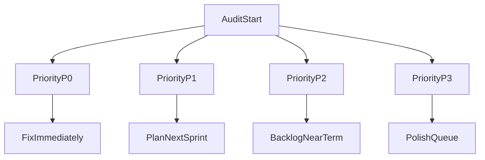

# Kapsamlı Kalite Tespit ve Önceliklendirme Planı

## 1) Kapsam ve Denetim Yüzeyi
- Ana odak uygulama: [`/Users/ugurmac/Desktop/ugurhoca/matematik-platform`](/Users/ugurmac/Desktop/ugurhoca/matematik-platform)
- Yardımcı kontroller:
  - CI hattı: [`/Users/ugurmac/Desktop/ugurhoca/.github/workflows/ci.yml`](/Users/ugurmac/Desktop/ugurhoca/.github/workflows/ci.yml)
  - Repo script orkestrasyonu: [`/Users/ugurmac/Desktop/ugurhoca/package.json`](/Users/ugurmac/Desktop/ugurhoca/package.json)

## 2) Tespit Kategorileri (Senin listene göre genişletilmiş)
- Çalışmayan butonlar/aksiyonlar (onclick, submit, disabled state, route geçişi)
- Formlarda yanlış alana yazım veya hiç yazılamama (input binding/state/sync)
- Mantık hataları (yanlış koşul, sınır durumları, auth/role akışı)
- Geri bildirim eksiklikleri (loading/success/error/toast/inline validation)
- Kod hataları/eksikleri (type, lint, exception handling, null/undefined)
- Çalışmayan özellikler (API endpoint, veri akışı, entegrasyon kırıkları)
- Yazım/terim hataları (TR içerik, tutarsız metin)
- Görsel/yazı kaymaları (responsive kırılımlar, taşma, hizalama, contrast)
- Ek risk yüzeyi: güvenlik ve veri doğruluğu (validation, RLS/policy, env)

## 3) Uygulama Alanlarına Göre İnceleme Sırası
1. Kullanıcıya direkt dokunan ekranlar
   - UI rotaları: [`/Users/ugurmac/Desktop/ugurhoca/matematik-platform/src/app`](/Users/ugurmac/Desktop/ugurhoca/matematik-platform/src/app)
   - Bileşenler: [`/Users/ugurmac/Desktop/ugurhoca/matematik-platform/src/components`](/Users/ugurmac/Desktop/ugurhoca/matematik-platform/src/components)
   - Özellik modülleri: [`/Users/ugurmac/Desktop/ugurhoca/matematik-platform/src/features`](/Users/ugurmac/Desktop/ugurhoca/matematik-platform/src/features)
2. API ve doğrulama katmanı
   - Endpointler: [`/Users/ugurmac/Desktop/ugurhoca/matematik-platform/src/app/api`](/Users/ugurmac/Desktop/ugurhoca/matematik-platform/src/app/api)
   - Şema/validation: [`/Users/ugurmac/Desktop/ugurhoca/matematik-platform/src/lib/route-schemas.ts`](/Users/ugurmac/Desktop/ugurhoca/matematik-platform/src/lib/route-schemas.ts), [`/Users/ugurmac/Desktop/ugurhoca/matematik-platform/src/lib/validation`](/Users/ugurmac/Desktop/ugurhoca/matematik-platform/src/lib/validation)
3. Veri ve auth katmanı
   - Supabase istemcileri: [`/Users/ugurmac/Desktop/ugurhoca/matematik-platform/src/lib/supabase`](/Users/ugurmac/Desktop/ugurhoca/matematik-platform/src/lib/supabase)
   - Migration/policy: [`/Users/ugurmac/Desktop/ugurhoca/matematik-platform/supabase/migrations`](/Users/ugurmac/Desktop/ugurhoca/matematik-platform/supabase/migrations)
4. Kalite kapıları
   - Test altyapısı: [`/Users/ugurmac/Desktop/ugurhoca/matematik-platform/vitest.config.ts`](/Users/ugurmac/Desktop/ugurhoca/matematik-platform/vitest.config.ts), [`/Users/ugurmac/Desktop/ugurhoca/matematik-platform/src/test/setup.ts`](/Users/ugurmac/Desktop/ugurhoca/matematik-platform/src/test/setup.ts)
   - Lint/Typecheck: [`/Users/ugurmac/Desktop/ugurhoca/matematik-platform/eslint.config.mjs`](/Users/ugurmac/Desktop/ugurhoca/matematik-platform/eslint.config.mjs), [`/Users/ugurmac/Desktop/ugurhoca/matematik-platform/tsconfig.json`](/Users/ugurmac/Desktop/ugurhoca/matematik-platform/tsconfig.json)

## 4) Tespit Yöntemi (Nasıl yakalayacağız)
- Statik kontroller: `typecheck`, `lint`, `test`, `build` çıktıları ile bloklayıcı hataları toplama
- Kod taraması: kritik akışlarda event-handler, form state, async error handling, edge-case analizi
- Senaryo bazlı fonksiyonel inceleme: buton/form/özellik akışlarının beklenen-actual karşılaştırması
- UI/UX kontrol listesi: breakpoint bazlı hizalama, metin taşması, yanlış kopya ve geri bildirim boşlukları
- Entegrasyon kontrolü: API request/response şema uyumu, auth ve yetki denetimi

## 5) Önceliklendirme Hiyerarşisi (Etki + Efor Dengeli)
- P0 (Acil, hemen):
  - Çalışmayan temel akışlar (giriş, kayıt, kritik buton, ödeme/işlem benzeri ana fonksiyon)
  - Veri kaybı, güvenlik açığı, yetkisiz erişim, tamamen bozulan endpoint
- P1 (Yüksek):
  - Mantık hataları ve yanlış sonuç üreten iş kuralları
  - Kullanıcıyı bloklayan validation/geri bildirim eksiklikleri
- P2 (Orta):
  - Kısmi işlev bozuklukları, belirli edge-case hataları
  - UI hizalama/sapma, mobilde bozulma, önemli fakat bloke etmeyen copy hataları
- P3 (Düşük):
  - Kozmetik yazım hataları, küçük spacing/typography tutarsızlıkları
  - Non-critical refactor ve teknik borç notları

## 6) Çıktı Formatı (Teslim şekli)
- Her bulgu için tek satır standart:
  - `ID | Öncelik | Alan | Dosya/Yol | Semptom | Muhtemel Kök Neden | Önerilen Çözüm | Doğrulama Adımı`
- Sonunda 3 özet bölümü:
  - Kritik risk özeti (P0/P1)
  - Hızlı kazanımlar (düşük efor, yüksek etki)
  - Test açığı haritası (hangi bug türü neden kaçmış)

## 7) Uygulama Sırası (Operasyon)
1. Otomatik kalite kapıları (lint/type/test/build)
2. Kritik kullanıcı akışları (buton/form/özellik)
3. API + validation + auth
4. UI metin ve responsive inceleme
5. Bulguları P0→P3 sıralı backlog’a dönüştürme

## 8) Başarı Kriteri
- Tespit listesi tüm istenen kategorileri kapsar
- Her bulgu için net dosya/alan ve doğrulama adımı vardır
- Öncelik sırası uygulanabilir ve sprint planına doğrudan taşınabilir durumdadır
