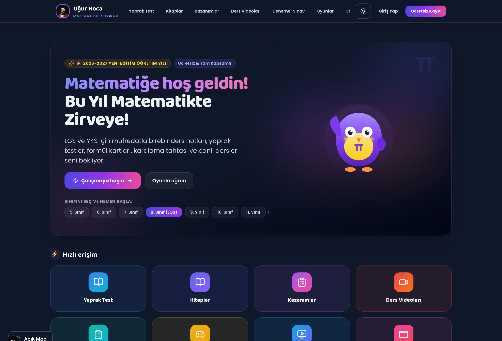

# Uğur Hoca Mathematics Platform

[Türkçe](README.md) | English

Uğur Hoca Mathematics Platform is a modern online learning space designed to help students learn mathematics with joy, reinforce concepts through interactive live lessons, overcome difficulties, and step steadily toward their academic goals.

With its clean and distraction-free design, the platform keeps the focus entirely on learning, practice, and personal growth.

---

## What Does the Platform Offer?

- 🎓 **Interactive Live Classes:** Real-time live classes with the teacher, student question desk, digital whiteboard for drawing and geometry, and timestamped replay recordings.
- ⏱️ **Exam & Pacing Coach:** Real-time pacing indicators for high school and university entrance exams (LGS & YKS) that build optimal test timing habits and question-skipping strategies.
- 💡 **Step-by-Step Hint Ladder:** Intelligent pedagogical hints that guide students through problem-solving steps without spoiling the answer.
- 🗂️ **Spaced Repetition & Formula Flashcards:** A smart review system that systematically reinforces math formulas and concepts into long-term memory.
- 📊 **Monthly Growth Report & Certificate of Achievement:** Monthly progress reports highlighting study time and topic mastery, accompanied by a printable official Certificate of Achievement.
- 🎮 **18 Educational Math Games:** Engaging games designed to build mental math speed, coordinate geometry, fractions, and factor recognition.
- 📝 **Homework Tracking & Printable Worksheets:** Easy submission and tracking of assignments, alongside 1-click printable A4 worksheets with answer keys.
- 💬 **Enhanced Chat Bubble & 1-on-1 Teacher Messaging:** Real-time typing indicators, WhatsApp-style read receipts (✓✓), formula and question quote/reply support, 60-second voice note recording with integrated audio player, multi-image and PDF worksheet attachments, in-chat search, and student quick question templates.
- 📱 **Seamless on All Devices:** Optimized for desktop, tablet, and mobile with 1-tap installation to home screens.

---

## Student Privacy & Security

Student privacy and well-being are paramount on the platform:
- All study statistics, test scores, and homework submissions are private to each individual student.
- Leaderboards and games display pseudonyms instead of real student names.
- Students never see each other's test results, notes, or private communication.

---

## Changelog

### v1.3.2 - Recent Documents Removal & Success Roadmap Relocation
- **Removed Recent Documents Section:** To further minimize homepage clutter and redundant vertical scroll, the recent documents module has been completely removed from the homepage flow.
- **Relocated Success Roadmap:** The "Success Roadmap" section was moved directly beneath the Announcements module under the Category Hub for better progression visibility.
- **Refined Section Flow:** Hero Greeting ➔ Category Hub (Lessons, Games, Tools) ➔ Announcements ➔ Success Roadmap ➔ LGS/YKS Countdown ➔ Quote of the Day ➔ Contact Uğur Hoca.

### v1.3.1 - Mobile Experience & Thumb Ergonomics Optimization
- **Sticky Mobile Category Bar:** Category bar now sticks cleanly under the top navbar on mobile, enabling one-thumb category switching from anywhere on the page without scrolling back to the top.
- **Segmented Mobile Pill Switcher:** Replaced bulky stacked cards with a compact, single-row iOS/Android segmented pill bar for mobile devices.
- **4-Column Lesson App Grid:** Reorganized the 8 lesson categories into a 4-column launcher grid on mobile, condensing 4 tall rows into 2 compact rows and reducing vertical scroll by ~60%.
- **Mobile Quick Tool Filter Chips:** Added instant horizontal filter chips (`All`, `🎯 Exam & Scores`, `📖 Formulas & Proofs`, `⏱️ Plan & Focus`, `✏️ Board & Practice`) in the Tools tab for instant tool discovery.

### v1.3.0 - Homepage Category Architecture & Streamlined Layout
- **Compact Category Hub:** Eliminated endless vertical scrolling and page bloat by consolidating homepage modules into 3 intuitive tabs: **Lessons**, **Games**, and **Tools**.
- **Lessons Tab:** Consolidated 8 learning modules (Worksheets, Books, Learning Outcomes, Video Lectures, Practice Exams, Live Classes, Exit Tickets, Programs - games excluded), recently added documents, student homework, and the success roadmap.
- **Games Tab:** Features the Daily Math Challenge, 60s Speed Drill quick modal trainer, and interactive math game portals.
- **Tools Tab:** Unified all 12 supercharged student tools (Exam score & net calculators, Pomodoro, Scratchpad, Flashcards, Graphs, LGS Tactics Corner, and Daily Goal Tracker).
- **Streamlined Order & Rollback Capability:** Standardized flow below the categories: Announcements ➔ LGS/YKS Countdown ➔ Quote of the Day ➔ Contact Uğur Hoca. Includes a one-click live toggle and `?layout=classic` parameter to view or revert to the classic long layout anytime.

### v1.2.1 - Chat Window Scroll Isolation, Refined Scrollbars & Overflow Protection
- **Scroll Bleed Prevention:** Added `useScrollContainment` hook and CSS overscroll containment to isolate chat scrolling from the background website.
- **Subtle Scrollbars:** Refined global scrollbars to a 5px thin, modern translucent pill style; completely hid scrollbars on horizontal quick template and math symbol chips.
- **Horizontal Drift & Overflow Fix:** Added `overflow-x-hidden` and word breaking to the message stream to eliminate horizontal drift and formula layout shifts during vertical scrolling.

### v1.1.0 - Enhanced Chat Bubble & Educational Messaging
- **Real-time Interaction:** Live typing indicators and message delivery/read receipts (✓ / ✓✓) powered by Supabase Realtime broadcast channels.
- **Rich Messaging & Voice Notes:** MediaRecorder audio recording, waveform audio player, and quote & reply support.
- **Multiple Attachments & PDFs:** Multi-file image uploads and PDF worksheet attachment preview support.
- **In-Chat Search & Quick Templates:** Instant message search, one-tap student question templates, and dynamic teacher online status.
- **Theme & Accessibility:** Full light/dark theme synchronization, dialog accessibility standards, focus trapping, and autofocus.

---

## Contact

- **Website:** [ugurhoca.com](https://ugurhoca.com)
