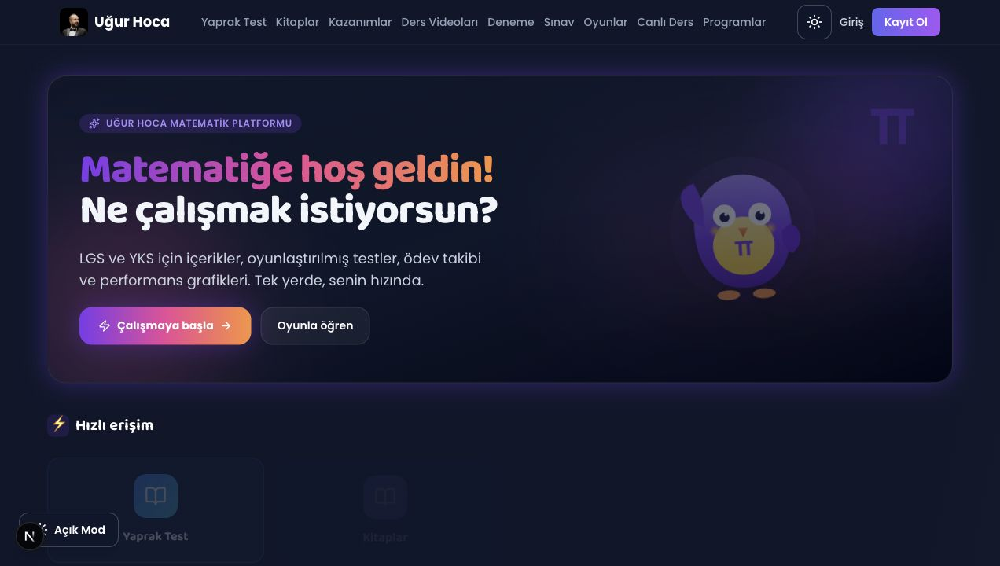

# Uğur Hoca Matematik Platformu

[English](README.en.md) | Türkçe

Uğur Hoca Matematik Platformu; öğrencilerin matematik çalışmasını, test çözmesini, ödevlerini takip etmesini, öğretmenle iletişim kurmasını ve canlı derslere katılmasını sağlayan modern bir eğitim uygulamasıdır.

Platformun odağı sade bir öğrenci deneyimi, güçlü öğretmen yönetimi ve güvenli veri erişimidir. Öğrenciler yalnızca kendi içeriklerini, sonuçlarını ve mesajlarını görür; öğretmen paneli ise takip, ölçme ve geri bildirim süreçlerini tek yerden yönetir.



## Öne Çıkanlar

- **Canlı ders:** LiveKit tabanlı oda yapısı, öğretmen ekran paylaşımı, öğrenci tam ekran izleme, mikrofon izin yönetimi, katılım onayı ve canlı sohbet.
- **Test sistemi:** Zamanlı testler, doğru/yanlış takibi, sonuç ekranı, çözüm geri bildirimi ve PDF çıktıları.
- **Ödev yönetimi:** Öğrenciye veya sınıfa ödev atama, dosya teslimi, teslim inceleme ve puanlama.
- **İlerleme takibi:** Çalışma süresi, hedefler, günlük seri, grafikler ve öğrenci gelişim özeti.
- **Oyunlaştırma:** Matematik oyunları, rozetler, puanlama ve gizliliği koruyan rumuzlu liderlik yapısı.
- **Öğretmen paneli:** Kullanıcı yönetimi, içerik yönetimi, duyurular, mesajlar, takip merkezi ve canlı ders planlama.
- **İçerik kütüphanesi:** Dokümanlar, yaprak testler, konu içerikleri ve LGS/YKS odaklı çalışma kaynakları.
- **Mobil uyum:** PWA desteği, responsive arayüz ve telefon/tablet kullanımına uygun akışlar.

## Teknoloji Yığını

- **Uygulama:** Next.js 16, React 19, TypeScript
- **Arayüz:** Tailwind CSS, Framer Motion, Lucide React
- **Veri ve kimlik:** Supabase Auth, Postgres, Storage, Realtime, RLS politikaları
- **Canlı ders:** LiveKit
- **E-posta:** Resend
- **Test ve kalite:** Vitest, Testing Library, ESLint, Prettier, TypeScript
- **Dağıtım:** Vercel

## Proje Yapısı

```text
ugurhoca/
├── matematik-platform/          # Ana Next.js uygulaması
│   ├── src/
│   │   ├── app/                 # App Router sayfaları ve API route'ları
│   │   ├── components/          # Ortak UI bileşenleri
│   │   ├── features/            # Özellik bazlı modüller
│   │   ├── hooks/               # Ortak React hook'ları
│   │   ├── lib/                 # Yardımcı fonksiyonlar ve servisler
│   │   └── types/               # Ortak TypeScript tipleri
│   ├── public/                  # Statik dosyalar ve PWA varlıkları
│   ├── scripts/                 # Veri aktarımı ve kurulum scriptleri
│   └── supabase/migrations/     # Veritabanı migration dosyaları
├── docs/                        # Proje dokümantasyonu
├── package.json                 # Kök script yönlendiricileri
└── README.md
```

## Kurulum

### Gereksinimler

- Node.js 18 veya üzeri
- npm
- Supabase projesi
- Canlı ders kullanılacaksa LiveKit projesi

### Yerel Geliştirme

```bash
git clone https://github.com/kuarezma/ugurhoca.git
cd ugurhoca

npm install --prefix matematik-platform
npm run setup:env
```

`matematik-platform/.env.local` dosyasını kendi servis bilgilerinle doldur:

```env
NEXT_PUBLIC_SUPABASE_URL=https://YOUR_PROJECT_ID.supabase.co
NEXT_PUBLIC_SUPABASE_ANON_KEY=your_supabase_anon_key_here
SUPABASE_SERVICE_ROLE_KEY=your_supabase_service_role_key_here
ADMIN_EMAILS=admin@ugurhoca.com
RESEND_API_KEY=your_resend_api_key_here

# Canlı ders için
NEXT_PUBLIC_LIVEKIT_URL=wss://your-livekit-host
LIVEKIT_API_KEY=your_livekit_api_key
LIVEKIT_API_SECRET=your_livekit_api_secret
LESSON_TEACHER_SECRET=strong_teacher_secret
LESSON_PERSIST_SIGNING_SECRET=strong_persist_secret
```

Geliştirme sunucusunu başlat:

```bash
npm run dev
```

Uygulama varsayılan olarak `http://localhost:3000` adresinde çalışır.

## Komutlar

Kök dizinden çalıştırılabilir:

```bash
npm run dev            # Geliştirme sunucusu
npm run build          # Production build
npm run start          # Production sunucusu
npm run typecheck      # TypeScript kontrolü
npm run lint           # ESLint kontrolü
npm run lint:fix       # ESLint düzeltmeleri
npm run format         # Prettier formatlama
npm run format:check   # Format kontrolü
npm run test           # Vitest testleri
```

## Supabase Notları

Veritabanı şeması `matematik-platform/supabase/migrations/` altında tutulur. Yeni ortam kurulurken migration dosyaları Supabase projesine uygulanmalıdır.

Projede öğrenci gizliliği kritik kabul edilir:

- Öğrenciler başka öğrencilerin profilini, mesajını, ödev teslimini, test sonucunu veya çalışma verisini okuyamaz.
- Öğretmen/admin rolleri gerekli yönetim ekranlarına erişebilir.
- Genel görünümlerde gerçek öğrenci bilgisi yerine gizliliği koruyan yapılar tercih edilir.

## Dağıtım

Önerilen dağıtım ortamı Vercel'dir.

1. Depoyu Vercel'e import edin.
2. Build root olarak `matematik-platform` klasörünü kullanın.
3. `.env.local` içindeki gerekli değişkenleri Vercel Environment Variables alanına ekleyin.
4. Supabase migration ve storage ayarlarının production ortamında hazır olduğundan emin olun.
5. Deploy alın.

Canlı ders, e-posta ve cron işleri için ilgili servis anahtarlarının production ortamında ayrıca tanımlanması gerekir.

## Kalite Kontrol

Değişikliklerden önce veya deploy öncesi önerilen kontrol sırası:

```bash
npm run typecheck
npm run lint
npm run test
npm run build
```

Küçük UI değişikliklerinde ilgili sayfa mobil ve masaüstü görünümde ayrıca kontrol edilmelidir.

## Dokümantasyon

- [Web kalite ve profesyonellik planı](docs/web-kalite-ve-profesyonellik-plan.md)
- [GitHub CI rehberi](matematik-platform/docs/GITHUB_CI.md)
- [Performans notları](matematik-platform/docs/PERFORMANCE_BASELINE.md)
- [Quiz bundle import rehberi](matematik-platform/docs/QUIZ_BUNDLE_IMPORT.md)
- [İlerleme özeti](progress.md)

## Lisans

Bu proje özel kullanım için geliştirilmiştir. İzinsiz kopyalanamaz, dağıtılamaz veya ticari amaçla kullanılamaz.

## İletişim

- Web: [ugurhoca.com](https://ugurhoca.com)
- E-posta: admin@ugurhoca.com
