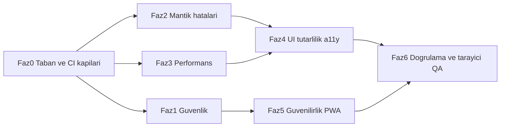

# Uğur Hoca — Kusursuz Site Kalite Planı

Hazırlanma tarihi: 4 Ekim 2026. Kaynak: Cloud Agent denetimi (güvenlik, UI/metin/a11y, performans/mimari, mantık hataları).

## Görev listesi (takip)

- [ ] Faz 0: middleware→proxy, og-image edge→nodejs, CI'ya e2e + Lighthouse error eşikleri + bundle bütçesi, .env.example eksikleri (composer-2.5, düşük)
- [ ] Faz 1: live_lesson_* RLS kapsamını üyelik/sınıf/admin ile daralt, teacher_proof gizle (opus-5-5-xhigh)
- [ ] Faz 1: erişim token çerezini HttpOnly server route'a taşı; proxy/requireAdmin/getVerifiedServerUser okuma yolunu güncelle (ayrı PR)
- [ ] Faz 1: content-documents PATCH auth, rate-limit fail-closed, admin allowlist tek kaynak, snapshot yerine verified user, ham hata sızıntıları, anon grant/USING(true) temizliği
- [ ] Faz 2: localStorage anahtarlarını userId ile ayır (quiz taslağı, hata defteri, favoriler, tamamlananlar, günlük hedef, bekleyen sonuçlar) + göç + çıkışta temizlik (opus-5-5-high)
- [ ] Faz 2: QuizResultsView indeks hatası, saveQuizResult kilidi/çift sayım, cevaplanmamış→hata defteri, timeLeft=0 taslak
- [ ] Faz 2: getCurrentWeekStart/Leitner/ödev takvimi UTC→yerel tarih; ExamCountdown hidrasyon
- [ ] Faz 2: Hangman kelime normalize, alias zorunluluğu, leaderboard period; admin deleteItem hata/rollback, grade string karşılaştırma, limit(1000); ödev late/unique; auth redirect ve Türkçe hata haritası
- [ ] Faz 3: MathText/katex dynamic, framer-motion'ı CookieBanner/HomeHero kritik yolundan çıkar, megabileşen bölme (opus-5-5-high)
- [ ] Faz 3: SSR seed varken yinelenen fetch'leri kes, admin SSR preload + Promise.all, programlar RSC preload/cache, content-prefetch Cache-Control, profil/ilerleme şelalesi, React.memo
- [ ] Faz 4: 244 theme-guard uyarısını semantik token/dark: çiftiyle kapat, kuralı error yap (sonnet-5-5-high)
- [ ] Faz 4: Ücretli/Burs, ParentReportModal yeniden adlandırma, Konu Paketleri test çelişkisi, sahte veri→boş durum, terminoloji tekilleştirme
- [ ] Faz 4: href '#', Suspense null→iskelet, !user→null, alert/prompt→Toast/Modal, useAccessibleModal eksik modallar, alt/aria-label, 44px hedefler, VisualMathProofsModal tekilleştir
- [ ] Faz 5: sw.js oturumlu HTML cache kaldır + offline.html, eksik loading/error segmentleri, merkezi Türkçe hata mesajı (sonnet-5-5-high)
- [ ] Faz 6: yeni birim/RLS testleri, e2e CI yeşil, Lighthouse, computerUse tarayıcı turu (açık/koyu, mobil), task.md ve plan dokümanı güncelle (opus-5-5-high)

## Mevcut durum (bu ortamda ölçüldü)

- `tsc --noEmit`: 0 hata. `eslint .`: 0 hata, **244 uyarı** (hepsi `theme-guard/no-unsafe-light-theme-utility`, 64 dosya; en yoğun: `VisualMathProofsModal` 24, `HomeHeroSection` 22, `StudentPortfolioModal` 21, `icerikler/loading.tsx` 13).
- Vitest: 213 dosya / 804 test geçti; kapsam %61 satır / %53 dal.
- `next build`: 66 rota başarılı; uyarılar: `middleware` → `proxy` dosya adı deprecated; `opengraph-image.tsx` `runtime='edge'` deprecated.
- CI (`.github/workflows/ci.yml`): typecheck+lint+test+build var; **e2e suite (auth/quizzes/assignments/live-lessons/exit-ticket) CI'da yok**, Lighthouse eşikleri yalnızca `warn`.

Bağlayıcı kısıtlar: font/renk/tema/düzen **değişmez** (yalnızca teknik düzeltme), ücretli/abonelik/veli dili yok, yetki server'da (`requireAdmin`/`getVerifiedServerUser` + RLS).

## Faz bağımlılığı

---

## Faz 0 — Taban ve kalite kapıları (model: `composer-2.5`, efor: düşük)

- `src/middleware.ts` → `src/proxy.ts` (Next 16 codemod `middleware-to-proxy`); `middleware.test.ts` güncelle.
- `src/app/opengraph-image.tsx`: `runtime='edge'` kaldır (nodejs varsayılan).
- CI'ya e2e job ekle (`playwright test`, build sonrası `next start`), Lighthouse assert'leri kritik metriklerde `error` yap, basit bundle-size bütçesi (analyze çıktısı karşılaştırma script'i zaten var: `scripts/bundle-analyze-compare.mjs`).
- `.env.example`'a eksik değişkenler: `ADMIN_EMAIL`, `LIVEKIT_URL`.

## Faz 1 — Güvenlik (model: `claude-opus-5-5-xhigh`, efor: yüksek)

- **KRİTİK** Canlı ders RLS: `supabase/migrations/20260514120000_live_lessons.sql` L80–98 tüm `live_lesson_*` tablolarında `USING (auth.role()='authenticated')` → öğrenci B'nin sohbetini/katılımını/`teacher_proof`'u okuyabiliyor. Yeni migration: üyelik/`target_grade`/`target_student_ids`/admin kapsamı; `teacher_proof` istemciden gizle.
- **KRİTİK** Erişim token'ı JS-yazılabilir çerezde (`src/lib/auth-client.ts` L49–61 `writeAccessTokenCookie`). XSS → hesap ele geçirme. Server route ile HttpOnly+Secure çerez yaz/sil; `proxy.ts` ve `requireAdmin`/`getVerifiedServerUser` okuma yolunu buna taşı. (En invaziv değişiklik; ayrı PR, auth e2e ile korunur.)
- **YÜKSEK** `api/content-documents/route.ts` PATCH: kimliksiz service-role ile `views/downloads/likes` artırma → anon istemci + RLS/RPC + rate-limit.
- **YÜKSEK** `src/lib/rate-limit.ts` Upstash yoksa fail-open → prod'da fail-closed veya bellek-içi fallback.
- **YÜKSEK** Admin allowlist tutarsızlığı: `src/lib/admin.ts` (`ADMIN_EXTRA_EMAILS`) ile SQL `is_admin_email()` (`20260907100000_align_is_admin_email_helper.sql`, hâlâ `admin@matematiklab.com`) → tek kaynak.
- **YÜKSEK** SSR kişiselleştirme imzasız `ugurhoca_auth_snapshot` çerezine güveniyor (`features/{assignments,quizzes,content,progress}/server.ts`) → `getVerifiedServerUser()`.
- **ORTA** Ham hata sızıntısı: `admin-reset-password` L86–94, `content-prefetch`, `live-lessons/*`, `discover-week`, `cron/worksheet-candidates` → genel Türkçe mesaj, sunucuda logla. `csp-report`'a rate limit. `student_groups` ve eski `chat_*` tablolarında `USING (true)` / `anon` grant temizliği; `quiz_results` anon grant kaldır.
- Bildirim/duyuru `link_url`/`file_url` için şema/host allowlist (`ProfilePage.tsx` L306–307, L416–422).

## Faz 2 — Mantık hataları (model: `claude-opus-5-5-high`, efor: yüksek)

- **YÜKSEK** Paylaşılan cihazda kullanıcı karışması: localStorage anahtarları kullanıcıya göre ayrılmamış — quiz taslağı (`quizzes/utils/quizDraftStorage.ts`), hata defteri (`mistakeStorage.ts`), favoriler (`useCloudFavorites.ts` `'favorites'`), tamamlananlar (`useContentCompletion.ts`), günlük hedef, bekleyen sonuçlar (`TestsPage.tsx` L360/905). Ortak `userScopedStorage(userId)` yardımcı + eski anahtar göçü + çıkışta temizlik.
- **YÜKSEK** `QuizResultsView.tsx` L62–68: `Object.values(answers)` indeks kayması (atlanan soru) → doğru/yanlış sayısı yanlış. `quizQuestions.map((_, i) => answers[i])`.
- **YÜKSEK** `TestsPage.tsx` L842–865: `saveMistakesToBank`/`incrementQuestionsSolved` `resultSavedRef` kilidinden **önce** çalışıyor → çift sayım; cevaplanmamış sorular hata defterine giriyor.
- **YÜKSEK** `Hangman.tsx` L38/53/55: `Kenarortay`, `ALT KÜME`, `EVrensel` — klavye yalnızca büyük harf, boşluk yok → kazanılamaz tur. Kelimeleri normalize et + boşlukları otomatik aç.
- **YÜKSEK** `progress/utils.ts` L7–12 `getCurrentWeekStart` `toISOString()` UTC → Türkiye'de pazartesi sabahı hafta kayması; aynı UTC hatası `mistakeStorage.ts` L58–62 (Leitner "bugün") ve `HomeworkLoadCalendarModal.tsx` L78–80.
- **YÜKSEK** `useAdminListActions.ts` L106–140 `deleteItem` hata kontrolsüz optimistik silme → UI'dan gider, DB'de kalır.
- **ORTA** Ödev: gecikmiş teslimde `late` bayrağı yok; `assignment_submissions` tekil kısıt yok (migration `UNIQUE(assignment_id, student_id)` + upsert). `useProfileDashboardData.ts` L241–253 `markAllAsRead` yarış koşulu. `AdminGradeUpdateTab.tsx` L54–56 sayı/string sınıf karşılaştırması. `admin/queries.ts` L458–501 sabit `.limit(1000)` sessiz kesme. Oyun: alias modalı kapatılınca skor sessizce kaybolur; liderlik fallback `period` yoksayar. Deep link `?id=` bulunamayınca sessiz. `LoginPage.tsx` L24–36 redirect doğrulaması `\` kabul ediyor; `ResetPasswordPage` recovery oturumu kontrolü yok; ham İngilizce Supabase hataları → merkezi `toUserMessage()`.

## Faz 3 — Performans / "sıfır gecikme" (model: `claude-opus-5-5-high`, efor: orta-yüksek)

- `MathText` (katex + CSS) `TestsPage.tsx:38`'de statik → `next/dynamic`; ilk ekranda matematik gerekmeyen yerlerde geç yükle.
- framer-motion kritik yoldan çıkar: `Providers` → `CookieBanner.tsx:5` (CSS geçişe çevir); `HomeHeroSection.tsx` üst katlamada motion'ı ertele.
- SSR seed varken yinelenen istemci fetch'lerini kes (`ContentsPage` auth sonrası ikinci yükleme; `ProfilePage`); `/admin` için SSR preload + `Promise.all(loadData, drive, worksheet)`; 30s kullanıcı polling → realtime/daha uzun aralık.
- `/programlar/lgs|yks`: `cache:'no-store'` istemci fetch → RSC preload veya `Cache-Control`/`revalidate`; `/api/content-prefetch` yanıtına `Cache-Control`.
- Profil/ilerleme SSR şelalesi (`profile/server.ts` L83–165, `progress/server.ts` L55–89): profil sorgusunu paralel kümeyle örtüştür.
- Sıcak listelerde `React.memo` (quiz kartları, içerik kartları), inline obje prop'ları kaldır.
- Megabileşen bölme (yalnızca kodu parçalama, görsel aynı): `TestsPage` 2064, `ContentsPage` 2020, `AdminPage` 1478 satır → lazy panel/alt bileşen.
- `ExamCountdownCard.tsx` L61–63 `Date.now()` render'da → hidrasyon uyumsuzluğu; `useEffect`'e taşı.

## Faz 4 — Görsel/metin tutarlılığı ve erişilebilirlik (model: `claude-sonnet-5-5-high`, efor: orta; mekanik tarama kısmı `gemini-3.8-flash-high`)

- 244 `theme-guard` uyarısını kapat: bare `text-white`/`bg-slate-9xx` → semantik token veya `dark:` çifti (yazdırılabilir/oyun/gradyan CTA istisnaları işaretle). Hedef: lint 0 uyarı, kuralı `error`'a yükselt.
- Ürün kuralı: `YksProgramPage.tsx:713` "Ücretli / Burs Yok" → "Burssuz"; `ParentReportModal` → `GrowthReportModal` adlandırma + veli odaklı kopya temizliği (öğrencinin kendi karnesi olarak kalır); `content-language.test.ts` ile "Konu Paketleri" çelişkisini çöz (test istisnası veya ad).
- Sahte veri → gerçek veri ya da dürüst boş durum: `WeeklyMockLeagueModal` (`MOCK_LEAGUE_RANKINGS`, "148 Öğrenci", "%78"), `LessonReplayArchiveModal`, `OfflineStudyPackageModal`.
- Ölü/kırık UX: `AssignmentSubmissionModal.tsx:105` `href ?? '#'`; `Suspense fallback={null}` (`app/page.tsx:27`, `app/testler/page.tsx:19`, `ContentsPage:1413`) → iskelet; `ProfilePage:570` / `TestsPage:1008` `if(!user) return null` → yönlendirme/boş durum; native `alert/confirm/prompt` (LiveLessonsPage, AdminPage, NotesSection, MistakeNotebookModal…) → `Toast`/`ui/Modal`.
- Terminoloji sözlüğü ve tek geçiş: "Test" (UI) / "Sınav" yalnızca deneme bağlamında; "İçerik/Belge" tekilleştir. CSV/PDF dosya adlarında ASCII (`Ugur-Hoca-Ogrenci-...`) → Türkçe karakter güvenli ama tutarlı.
- A11y: `useAccessibleModal` kullanmayan ~15 modal (`VisualMathProofsModal`, `AdminBroadcastModal`, `ExitTicketCreateModal`, `TopicChecklistModal`, live-lesson modalları…) bağlanır; `HomeAnnouncementsSection.tsx:62` boş `alt`; `NotesSection.tsx:534` etiketsiz ikon buton; `h-8/h-9` dokunma hedefleri ≥44px (görsel boyutu koruyarak `before:` hit-area). Kök `components/VisualMathProofsModal.tsx` ile `features/proofs/...` çift uygulaması tekilleştir.

## Faz 5 — Güvenilirlik, PWA, hata durumları (model: `claude-sonnet-5-5-high`, efor: orta)

- `public/sw.js`: oturumlu rotaların HTML'ini önbelleğe almayı bırak (`/profil`, `/odevler`, `/testler`…); gerçek `public/offline.html` fallback; `CACHE_NAME` sürüm bump prosedürü; `/icon.svg`'nin `/public` yolunda sunulduğunu doğrula (verify).
- Eksik `loading.tsx`/`error.tsx`: `/araclar/*` alt araçlar, `/canli-ders/d/[roomId]`; segment `error.tsx` yalnızca `/`, `/admin`, `/canli-ders`'te — kritik rotalara ekle.
- Merkezi hata→kullanıcı mesajı haritası (Türkçe), yutulan `catch {}`'lerde sonuç kaydı başarısızlıklarını toast'la.

## Faz 6 — Doğrulama ve tarayıcı QA (model: `claude-opus-5-5-high` + `computerUse`, efor: orta)

- Her fazda: `typecheck` + `lint` (0 uyarı hedefi) + `test` + `build`; yeni birim testleri (hafta başlangıcı, quiz sonuç sayımı, Hangman normalize, user-scoped storage, admin delete rollback, RLS politika testleri SQL).
- Playwright e2e CI'da; mobil Pixel 7 + chromium; Lighthouse 4 URL `error` eşikleri.
- Manuel tarayıcı turu (dev server + computerUse): `/`, `/icerikler`, `/testler` (quiz bitirme), `/odevler`, `/ilerleme`, `/oyunlar` (Hangman), `/profil`, `/programlar/lgs`, `/giris`/`/kayit`, `/admin`; açık+koyu tema; 320px.
- Dokümantasyon: `task.md` §28 ve `docs/web-kalite-ve-profesyonellik-plan.md` karar kaydı.

## Model yönlendirme ve koordinasyon kuralı (kullanıcı talimatı)

- Koordinatör (bu oturum) **hiçbir kod değişikliği yapmaz**; yalnızca alt ajanları çağırır, çıktıları doğrular, dalları/PR'ları yönetir ve fazlar arası geçişi sağlar.
- Yürütücü modeller ve kaynak sırası:
  - **Opus 5.5** (Faz 1 güvenlik `xhigh`; Faz 2, 3, 6 `high`): 1) Antigravity, 2) kota biterse Claude Code.
  - **Sonnet 5.5** (Faz 4, 5 `high`): 1) Antigravity, 2) kota biterse Claude Code.
  - **Gemini 3.8** (Faz 4 mekanik tarama: theme-guard toplu dönüşüm, metin/terminoloji taraması): Antigravity.
  - **Diğer tüm işler** (Faz 0 taban/CI, küçük düzeltmeler, doküman güncellemesi, doğrulama tekrarları): **Codex içindeki `gpt-6.1-sol`** (`codex exec -m gpt-6.1-sol -c model_reasoning_effort=high "<görev>"`). Doğrulandı: GPT-6.1 Sol 29 Eyl 2026'da Codex varsayılan katalog modeli; efor low–ultra.
- Bu VM'deki gerçek durum ve köprüleme:
  - `codex` / `claude` CLI kurulu değil, kimlik bilgisi yok. **Codex yolu:** `npm i -g @openai/codex` + Cursor Dashboard → Cloud Agents → Secrets'a `OPENAI_API_KEY` (veya `CODEX_API_KEY`) eklenmesi; ardından koordinatör her görevi `codex exec` alt süreci olarak çalışma ağacında çalıştırır. **Claude Code yolu:** `npm i -g @anthropic-ai/claude-code` + `ANTHROPIC_API_KEY` secret; `claude -p --model <opus|sonnet>` ile yürütülür.
  - **Antigravity** bir IDE'dir, bu VM'den başsız (headless) sürülemez. Kullanıcı Antigravity'yi kendi makinesinde kullanıyorsa koordinatör görev paketini (dosya listesi + kabul kriteri + doğrulama komutları) hazırlar, kullanıcı Antigravity'de çalıştırıp dalı push eder, koordinatör doğrular. Aksi hâlde Antigravity adımı atlanır ve aynı model ailesinin bir sonraki kaynağına (Claude Code → yoksa Cursor alt ajanı `claude-opus-5-5-*` / `claude-sonnet-5-5-*` / `gemini-3.8-flash-*`) geçilir.
  - Kota/hata durumunda sıra: Antigravity → Claude Code → Cursor alt ajanı (aynı aile). Hiçbiri yoksa görev bekletilir ve kullanıcıya bildirilir.
- Çakışma önleme: aynı anda yalnızca **bir faz** çalışma ağacında aktif olur; faz içinde birbirinden bağımsız dosya kümeleri varsa alt ajanlar sıralı çağrılır (paralel düzenleme çakışmasını önlemek için). Her faz kendi `cursor/<faz>-27c7` dalında, ayrı draft PR.
- Her alt ajan dönüşünde koordinatör yalnızca doğrulama komutlarını çalıştırır (`typecheck`, `lint`, `test`, `build`) ve sonucu bir sonraki ajana bağlam olarak iletir; düzeltme gerekiyorsa yeniden alt ajana devreder.

## Teslim biçimi

- Her faz ayrı `cursor/<faz>-27c7` dalı ve ayrı draft PR; Faz 1 HttpOnly çerez göçü kendi PR'ında.
- Değişmezler: görsel kimlik, veritabanı verisi (yalnızca RLS/kısıt migration'ları eklenir), ürün kapsamı (yeni özellik yok).

## Varsayımlar (itiraz yoksa böyle ilerlenir)

- "Gelişim Raporu" öğrencinin kendi karnesi olarak kalır; yalnızca veli-odaklı adlandırma/kopya kaldırılır.
- Sahte veri gösteren modallar gerçek veri kaynağı yoksa dürüst boş durum gösterir (kaldırılmaz).
- HttpOnly çerez göçü yapılır; eski çerez bir sürüm boyunca geriye dönük okunur.
