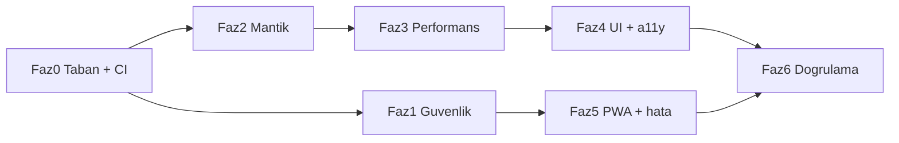

# Uğur Hoca — Kusursuz Site Kalite Planı (model yönlendirmesi güncel)

İlk sürüm: Cursor Cloud Agent, 4 Ekim 2026 (`origin/cursor/kusursuz-site-kalite-plani-27c7`, commit `6ebfda9`).
Bu sürüm: 4 Ekim 2026. Bulgu içeriği korunur, model/efor dağılımı ve yürütme düzeni güncel yönlendirmeye göre yeniden yazıldı
(kaynak: `~/CLAUDE.md` 29 Eyl 2026 tablosu + `~/.ai-routing/MODEL-ROUTING.md`).

## Yönlendirme kuralları (bu plan için bağlayıcı)

| Rol | Model / efor | Nereden çalışır |
|---|---|---|
| Şef: kırılım, görev kartı, kapı, review, merge | Opus 5.5 medium | Bu Claude Code oturumu; kod yazmaz |
| Kapılı, iyi tanımlı kod / bugfix | GPT-6.1 Sol medium | Codex |
| Zor / çok dosyalı kod (Sol medium 2 kez kırmızı) | Sol high → Opus 5.5 high | Codex → Antigravity → Claude Code |
| Tarama, mekanik, test, doküman, UI/görsel | Gemini 3.8 Flash high | Antigravity |
| Güvenlik sınırı, mimari | Opus 5.5 high (kritikse xhigh) | Antigravity → Claude Code |
| Bağımsız ikinci görüş (salt okunur) | Sol high (veya Gemini 3.1 Pro high) | Codex / Antigravity |

**Opus/Sonnet kaynak sırası:** önce Antigravity kotası, bitince Claude Code. Antigravity'de en üst efor `high`'dır;
`xhigh` (Opus) ve `max` (Sonnet) yalnız Claude Code ajanlarında (`opus-xhigh`, `sonnet-max`) vardır.
Sonnet 5.5 bu planda varsayılan yürütücü değildir; yalnız Opus kotası her iki araçta da bittiyse `high` ucuz basamak,
terminal ağırlıklı döngüde Opus high tıkanırsa `max`.

Çağrı şablonları (çalışma dizini her zaman fazın worktree'si):

```bash
# Gemini 3.8 Flash / Opus / Sonnet — Antigravity
agy -p "<görev kartı>" --model gemini-3.8-flash-high --mode accept-edits
agy -p "<görev kartı>" --model claude-opus-5-5-high --mode accept-edits
# Opus — Claude Code (Antigravity kotası bitince): Agent aracı subagent_type=opus-high | opus-xhigh
# GPT-6.1 Sol — Codex
codex exec -m gpt-6.1-sol -c model_reasoning_effort=medium --sandbox workspace-write "<görev kartı>"
# Salt okunur ikinci görüş
codex exec -m gpt-6.1-sol -c model_reasoning_effort=high -s read-only "<inceleme kartı>"
```

Gemini yoksa: kod → GLM 5.3 max, özet/doküman → Muse Spark 1.3 xhigh (yalnız mekanik iş). Grok kullanılmaz.

## Mevcut durum (4 Ekim 2026, yerelde doğrulandı)

- `eslint .`: 0 hata, **244 uyarı / 64 dosya** (hepsi `theme-guard`). Yerelde commit'lenmemiş 27 dosyalık tema değişikliği var; Faz 4'ten önce commit'lenmeli.
- **Canlı ders RLS açığı doğrulandı:** `supabase/migrations/20260514120000_live_lessons.sql` tüm `live_lesson_*` select politikaları `auth.role() = 'authenticated'`; sonraki üç migration bunu daraltmıyor.
- **JS-yazılabilir token çerezi doğrulandı:** `src/lib/auth-client.ts:61` erişim token'ını `document.cookie` ile yazıyor (HttpOnly değil).
- Cursor ölçümleri (doğrulanmadı): `tsc` 0 hata; Vitest 213 dosya / 804 test, kapsam %61 satır; `next build` 66 rota, `middleware`→`proxy` ve OG `edge` uyarıları; CI'da e2e yok, Lighthouse yalnız `warn`.

Bağlayıcı kısıtlar: font/renk/tema/düzen **değişmez**; ücretli/abonelik/veli dili yok; yetki server'da (`requireAdmin`/`getVerifiedServerUser` + RLS); yeni özellik yok.

## Yürütme düzeni



- Her faz kendi dalında ve worktree'sinde: `git worktree add -b kalite/faz-N-<konu> ../worktrees/kalite-faz-N main`; ayrı draft PR.
- Faz 1 ve Faz 2 dosya kümeleri ayrık olduğu için paralel yürüyebilir (Faz 1: `supabase/`, `src/lib/`, `src/app/api/`; Faz 2: `src/features/**/utils`, oyunlar, admin hook'ları). `TestsPage.tsx` Faz 2 → 3 → 4 sırasıyla tek elden geçer.
- Hata düzeltmelerinde önce kırmızı test, sonra düzeltme.
- Her teslimde şef kapısı: `npm run typecheck && npm run lint && npm test && npm run build`; kapıdan geçmeyen iş aynı modele en fazla 2 kez döner, sonra merdivende bir basamak çıkar.
- Durum `docs/coordination/board.json` üzerinden canlı panoya aktarılır; her model devri bir satırla `DEVIR-LOG.md`'ye yazılır.

---

## Faz 0 — Taban ve CI kapıları

| İş | Model / efor |
|---|---|
| `src/middleware.ts` → `src/proxy.ts` (Next 16 codemod) + `middleware.test.ts` | Gemini 3.8 Flash high |
| `opengraph-image.tsx` içinden `runtime='edge'` kaldır | Gemini 3.8 Flash high |
| `.env.example`: `ADMIN_EMAIL`, `LIVEKIT_URL` | Gemini 3.8 Flash high |
| CI'ya e2e job (build → `next start` → `playwright test`), kritik Lighthouse metrikleri `error`, bundle bütçesi (`scripts/bundle-analyze-compare.mjs`) | Sol medium |

## Faz 1 — Güvenlik (en acil)

| İş | Model / efor |
|---|---|
| **KRİTİK** Canlı ders RLS: yeni migration ile üyelik / `target_grade` / `target_student_ids` / admin kapsamı; `teacher_proof` istemciden gizle; SQL politika testleri | Opus 5.5 high (AGY → CC) |
| **KRİTİK** Erişim token'ını HttpOnly+Secure çereze taşı (server route yazar/siler); `proxy.ts`, `requireAdmin`, `getVerifiedServerUser` okuma yolu; eski çerez bir sürüm geriye dönük okunur. Ayrı PR, auth e2e ile korunur | Tasarım + uygulama: Opus 5.5 high (AGY → CC); sorun çıkarsa CC `opus-xhigh` |
| Faz 1 kritik iki PR'ın bağımsız incelemesi | Sol high, salt okunur |
| `api/content-documents` PATCH kimliksiz service-role → anon istemci + RLS/RPC + rate-limit | Sol medium |
| `rate-limit.ts` fail-open → prod'da fail-closed / bellek-içi fallback; `csp-report` rate limit | Sol medium |
| Admin allowlist tek kaynak (`src/lib/admin.ts` ↔ SQL `is_admin_email()`) | Sol medium |
| SSR kişiselleştirmede imzasız snapshot çerezi → `getVerifiedServerUser()` (`features/{assignments,quizzes,content,progress}/server.ts`) | Sol medium |
| `student_groups`, eski `chat_*` `USING (true)` / anon grant, `quiz_results` anon grant temizliği | Sol medium; migration'ı şef Opus review eder |
| Ham hata sızıntıları → genel Türkçe mesaj + sunucu logu (`admin-reset-password`, `content-prefetch`, `live-lessons/*`, `discover-week`, `cron/worksheet-candidates`) | Gemini 3.8 Flash high |
| Bildirim `link_url`/`file_url` şema/host allowlist (`ProfilePage.tsx`) | Sol medium |

## Faz 2 — Mantık hataları

| İş | Model / efor |
|---|---|
| `userScopedStorage(userId)` + eski anahtar göçü + çıkışta temizlik (quiz taslağı, hata defteri, favoriler, tamamlananlar, günlük hedef, bekleyen sonuçlar) | Sol high (çok dosyalı) |
| `QuizResultsView` indeks kayması; `TestsPage` `resultSavedRef` kilidi / çift sayım / cevaplanmamış → hata defteri; `timeLeft=0` taslak | Sol medium |
| UTC → yerel tarih: `getCurrentWeekStart`, Leitner "bugün", ödev takvimi | Sol medium |
| Hangman kelime normalize + boşluk otomatik açma; alias modalı skor kaybı; leaderboard `period` | Sol medium |
| `useAdminListActions.deleteItem` hata kontrolü + rollback; `AdminGradeUpdateTab` sayı/string; `admin/queries.ts` `.limit(1000)` | Sol medium |
| Ödev `late` bayrağı + `UNIQUE(assignment_id, student_id)` + upsert; `markAllAsRead` yarışı | Sol medium; migration'ı şef review eder |
| `LoginPage` redirect `\` kabulü; `ResetPasswordPage` recovery kontrolü; merkezi `toUserMessage()` | Sol medium |
| Yukarıdakilerin birim testleri (hafta başlangıcı, quiz sayımı, Hangman, scoped storage, delete rollback) | Gemini 3.8 Flash high |

## Faz 3 — Performans

| İş | Model / efor |
|---|---|
| `MathText`/katex `next/dynamic`; framer-motion'ı `CookieBanner` ve `HomeHeroSection` kritik yolundan çıkar (görsel aynı) | Sol medium |
| SSR seed varken yinelenen fetch'leri kes; `/admin` SSR preload + `Promise.all`; 30 sn polling; `/programlar` RSC preload/cache; `content-prefetch` `Cache-Control`; profil/ilerleme şelalesi | Sol high |
| Megabileşen bölme (`TestsPage` 2064, `ContentsPage` 2020, `AdminPage` 1478 satır), davranış korunur | Sol high → 2 kırmızıda Opus 5.5 high (AGY → CC) |
| Sıcak listelerde `React.memo`, inline obje prop'ları | Gemini 3.8 Flash high |
| `ExamCountdownCard` `Date.now()` hidrasyonu → `useEffect` | Sol medium |

## Faz 4 — Görsel/metin tutarlılığı ve erişilebilirlik

Önkoşul: yereldeki commit'lenmemiş tema değişikliği commit'lenir, uyarı sayısı yeniden ölçülür. Kontrast kapısı kırmızıysa önce rapor artifact'i okunur (kapı kararsız olabilir).

| İş | Model / efor |
|---|---|
| 244 `theme-guard` uyarısı → semantik token / `dark:` çifti; istisnalar işaretlenir; hedef 0 uyarı, kural `error` | Gemini 3.8 Flash high (dosya grupları halinde, her grup kapıdan) |
| Ürün dili: "Ücretli / Burs Yok" → "Burssuz"; `ParentReportModal` → `GrowthReportModal`; "Konu Paketleri" test çelişkisi; terminoloji tekilleştirme | Gemini 3.8 Flash high |
| Sahte veri → dürüst boş durum (`WeeklyMockLeagueModal`, `LessonReplayArchiveModal`, `OfflineStudyPackageModal`) | Gemini 3.8 Flash high |
| `href '#'`, `Suspense fallback={null}` → iskelet, `if(!user) return null`, native `alert/confirm/prompt` → Toast/Modal | Gemini 3.8 Flash high |
| ~15 modala `useAccessibleModal`, boş `alt`, etiketsiz ikon buton, 44px dokunma hedefi (görsel boyut korunur) | Gemini 3.8 Flash high |
| `VisualMathProofsModal` çift uygulamasını tekilleştir | Sol medium |

## Faz 5 — Güvenilirlik, PWA, hata durumları

| İş | Model / efor |
|---|---|
| `sw.js`: oturumlu rotaların HTML'ini önbelleğe alma; `offline.html`; `CACHE_NAME` sürüm prosedürü | Sol medium; şef Opus review (yanlış önbellek veri sızdırır) |
| Eksik `loading.tsx`/`error.tsx` (`/araclar/*`, `/canli-ders/d/[roomId]`, kritik rotalar) | Gemini 3.8 Flash high |
| Yutulan `catch {}`'lerde sonuç kaydı hatasını toast'la (Faz 2'deki `toUserMessage()` kullanılır) | Gemini 3.8 Flash high |

## Faz 6 — Doğrulama ve tarayıcı QA

| İş | Model / efor |
|---|---|
| RLS politika testleri, e2e'nin CI'da yeşil olması, Lighthouse `error` eşikleri | Gemini 3.8 Flash high |
| Tarayıcı turu: `/`, `/icerikler`, `/testler` (quiz bitirme), `/odevler`, `/ilerleme`, `/oyunlar` (Hangman), `/profil`, `/programlar/lgs`, `/giris`, `/kayit`, `/admin`; açık + koyu tema; 320px | Gemini 3.8 Flash high (Antigravity tarayıcısı) |
| Bütün dalların bağımsız final denetimi (salt okunur) | Gemini 3.1 Pro high veya Sol high |
| Final review ve merge kararı | Şef, Opus 5.5 medium |
| `task.md` §28 ve `docs/web-kalite-ve-profesyonellik-plan.md` karar kaydı | Gemini 3.8 Flash high |

## Değişmezler ve varsayımlar

- Görsel kimlik, veritabanı verisi (yalnız RLS/kısıt migration'ları eklenir), ürün kapsamı değişmez.
- "Gelişim Raporu" öğrencinin kendi karnesi olarak kalır; yalnız veli odaklı ad ve metin kalkar.
- Sahte veri gösteren modallar gerçek veri yoksa boş durum gösterir, kaldırılmaz.
- Push, merge ve production migration uygulama kararı kullanıcı onayıyla, devredilen ajana yaptırılmaz.
