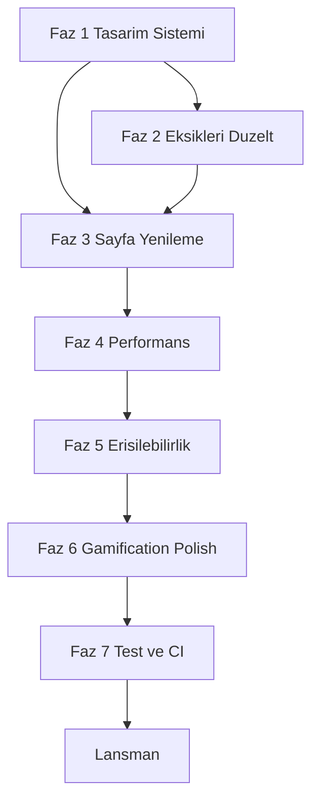

# Uğur Hoca — Tam Kapsamlı Vizyon Planı

> Opus 4.7 tarafından hazırlanan, ortaokul öğrencilerine hitap eden modern, hızlı, erişilebilir ve sıfır-bozuk-element bir platform için uçtan uca plan.

**Hedef:** hızlı, kusursuz, görsel olarak ortaokul öğrencisini heyecanlandıran ve tamamen profesyonel bir platform. Tüm değişiklikler mevcut Next.js 16 + Supabase mimarisi üzerinde yapılır; mevcut veri akışı bozulmaz.

---

## 0. Ön hazırlık (gün 0)

- `docs/web-kalite-ve-profesyonellik-plan.md` "font/renk değiştirme" kısıtlamasını iptal eden yeni bir bölüm eklenecek; tüm değişiklikler oradan izlenecek.
- `progress.md` içine "Vizyon Sprinti — Nisan 2026" başlığı açılacak.
- Tasarım referans paneli (moodboard): playful-academic, Duolingo/Kahoot ruhu, Türkçe UI.

---

## 1. Yeni tasarım sistemi (FAZ 1)

### 1.1 Renk paleti (ortaokul-dostu, canlı ama okunabilir)

`matematik-platform/tailwind.config.ts` içinde `theme.extend.colors` eklenecek. Yeni marka tokenları:

- `brand.primary` (enerjik mor): `#7C3AED`
- `brand.secondary` (elektrik mavisi): `#06B6D4`
- `brand.accent` (limonata sarı): `#FACC15`
- `brand.success` (taze yeşil): `#22C55E`
- `brand.danger` (kırmızı): `#EF4444`
- `brand.pink` (oyuncu pembe): `#EC4899`
- `brand.orange` (gün batımı): `#FB923C`
- Surface ölçeği: `surface.50…900` (hem açık hem koyu için)
- Gamification tokenları: `xp.bronze #C27C3C`, `xp.silver #94A3B8`, `xp.gold #FBBF24`, `xp.platinum #67E8F9`

`matematik-platform/src/app/globals.css` içindeki `:root` ve `html[data-theme='light']` bu yeni tokenlara göre yeniden yazılacak; eski `slate/indigo` referansları marka tokenlarına migrate edilecek.

### 1.2 Tipografi — Poppins + yeni display fontu

`matematik-platform/src/app/layout.tsx`:

- Mevcut `Poppins` (500/700) ağırlıkları `400/500/600/700/800` olacak.
- Yeni display fontu: `Fredoka` (Google Fonts, oyuncu ama temiz) veya `Baloo 2` — başlıklar için `--font-display`.
- `tailwind.config.ts`'de `fontFamily: { sans: ['var(--font-poppins)', ...], display: ['var(--font-display)', ...] }`.
- Tipografi ölçeği tek kaynakta: `display-xl (64/1.05), display-lg (48/1.1), h1 (36/1.15), h2 (28), h3 (22), body (16/1.6), small (14)` — `tailwind.config.ts`'e eklenir.

### 1.3 Paylaşılan UI primitive katmanı

Eksik olan merkezi katman kuruluyor. Yeni klasör: `matematik-platform/src/components/ui/`

Oluşturulacak dosyalar:
- `Button.tsx` — `variant: primary | secondary | ghost | destructive | success | xp`, `size: sm | md | lg`, `loading` state, ripple efekti, focus-visible ring
- `Card.tsx` + `Card.Header`, `Card.Body`, `Card.Footer` — tema farkında, `glow?: boolean`
- `Modal.tsx` — `useAccessibleModal`, focus trap, ESC, backdrop, scale+fade varyantları
- `Input.tsx`, `Textarea.tsx`, `Select.tsx`, `Checkbox.tsx` — hata/etiket/yardım metni, aria-invalid, karakter sayacı
- `Badge.tsx` — XP, rozet, durum
- `Tooltip.tsx` — Radix-free, framer-motion tabanlı
- `Avatar.tsx` — initials fallback, renkli gradient
- `EmptyState.tsx` — illüstrasyon + başlık + aksiyon (boş durumlar için)
- `Skeleton.tsx` — standart iskelet; shimmer animasyonu
- `Toast` sistemi genişletilecek (mevcut `Toast.tsx`'e success/warning/info/error varyantları + aksiyon butonu)

Tüm mevcut `glow-button`, `btn-primary`, `light-card` sınıfları **kademeli** olarak bu primitive'lere taşınacak; globals.css'te sadece tema token'ları kalır.

### 1.4 Maskot ve illüstrasyon kütüphanesi

`matematik-platform/public/mascot/` dizini oluşturulacak:

- SVG maskot (örn. "Pi" adında bir baykuş veya kedi karakter) — 6 poz: `waving`, `thinking`, `celebrate`, `confused`, `study`, `sleep`
- Boş durum illüstrasyonları: `empty-assignments.svg`, `empty-tests.svg`, `empty-content.svg`, `empty-notifications.svg`, `404.svg`, `offline.svg`, `error.svg`
- Başarı rozet ikonları (20+ SVG)
- Kaynak: AI ile üretilip vektörize; lisans uygun ise undraw.co stil
- Kullanım: `EmptyState`, `/not-found`, `/offline`, `error.tsx`, ödev tamamlama, quiz bitişi

### 1.5 Yeni animasyon kütüphanesi

`matematik-platform/tailwind.config.ts` `keyframes/animation` extend genişletilir:

- `wiggle` (ikon hover), `pop` (buton tıklama), `shine` (gradient kayması), `float-slow`, `bounce-soft`, `pulse-glow`, `confetti-pop`, `typewriter`, `gradient-flow`
- `prefers-reduced-motion` desteği globals.css'te sertleştirilir (tüm dekoratif animasyonlar devre dışı)

### 1.6 Arka plan efektleri

`matematik-platform/src/components/FloatingShapes.tsx` yenilenir:
- Matematik sembolleri (π, ∑, √, ∞, ±, ÷) yüzen parçacıklar olarak eklenir
- Renkler marka paletinden
- Mobilde devre dışı, reduced-motion'da devre dışı (mevcut davranış korunur)

Yeni: `matematik-platform/src/components/ParticleTrail.tsx` (kursör takip parçacıkları, opsiyonel ve yalnızca masaüstü)
Yeni: `matematik-platform/src/components/ConfettiBurst.tsx` (ortak konfeti sarmalayıcı, `canvas-confetti` lazy)

---

## 2. Tüm bozuk/eksik öğelerin düzeltilmesi (FAZ 2)

Denetimde tespit edilenler tek tek giderilecek.

### 2.1 Yer tutucu/"yakında" metinler

- `matematik-platform/src/features/quizzes/containers/TestsPage.tsx` 649–656: "Yakında bu sınıf seviyesi için yeni testler eklenecektir" metni, **aktif eylemli** `EmptyState` ile değişecek: "Bu sınıf için test hazırlanıyor. İçerikler > Ders Notları'ndan çalışmaya başlayabilirsin" + CTA.
- Tüm "yakında/coming soon" vb. metinler kaldırılacak; yerine gerçek değer öneren boş durumlar.

### 2.2 Bozuk bağlantılar / davranışlar

- `matematik-platform/src/features/assignments/components/AssignmentSubmissionModal.tsx` 98–106: `href={activeSubmission.file_url ?? '#'}` — dosya yoksa link tamamen render edilmeyecek, yerine "Önizleme yok" info kutusu gösterilecek.
- `matematik-platform/src/components/NotesSection.tsx` 433–439: `prompt('Bağlantı URL\'si:')` yerine `Modal` + `Input` + URL doğrulama (http/https zorunlu).
- `matematik-platform/src/features/content/containers/ContentsPage.tsx` 691+ admin `window.alert` çağrıları `Toast` sistemine taşınacak (admin de dahil).

### 2.3 `console.error` temizliği

Tüm üretim `console.error` çağrıları merkezi `lib/logger.ts`'e taşınacak:
- Sadece dev'de `console` yazar
- Prod'da Vercel Analytics/Sentry-lite hook'u bırakır (ileride Sentry eklenir)
- Dosyalar: `ProgressPage.tsx:221`, `TestsPage.tsx:126,141,153`, `HomeSupportSection.tsx:96`, `AssignmentsPage.tsx:219`, `app/error.tsx:15`, API route'ları, `pdf-export.ts:31`

### 2.4 Icon-only butonlara `aria-label`

Tümü düzeltilecek:
- `HomeNavbar.tsx` 95–104 (çıkış), 128–130 (menü)
- `app/giris/page.tsx` 160–169 (şifre göster)
- `RegisterPage.tsx` 248–257
- `NotesSection.tsx` 527–533 araç çubuğu
- `ContentQuickAddModal.tsx` 46
- `ThemeToggle.tsx` 14: `Aydinlik`, `Karanlik`, `Acik` → Türkçe karakterlerle (`Aydınlık moda geç`, `Karanlık moda geç`)

### 2.5 Modal erişilebilirliği

- `ProgressPage.tsx` 463–474: `useAccessibleModal` kullanacak şekilde `Modal` primitive'ine migrate edilecek.
- `ContentQuickAddModal.tsx` aynı şekilde.
- Tüm modal kapat butonlarına `aria-label="Kapat"`.

### 2.6 Klavye erişilebilirliği

- `GameCard.tsx` 12–18: `role="button" tabIndex={0} onKeyDown={Enter/Space}` veya `motion.button`'a migrate.
- Tüm tıklanabilir `div`'ler taranıp düzeltilecek.

### 2.7 Dokunma hedefi (min 44×44)

- `ThemeToggle` compact: `h-10 w-10` → `h-11 w-11`
- Hangman harfleri: `w-10 h-10` → `w-11 h-11`
- Notlar araç çubuğu: `p-2` → `p-2.5` + ikon `w-5 h-5`

### 2.8 Boş sayfa durumları

- `GamesPage.tsx` 23–25: `return null` yerine `Skeleton` + `EmptyState`
- İçerikler (ContentsPage): `filteredContents.length === 0` için `EmptyState` kartı
- Profil, sohbet, ilerleme "henüz veri yok" durumları standardize

### 2.9 Hatalı akışlar

- `/not-found` sayfası maskot + aksiyon önerisi ile yenilenir
- `app/global-error.tsx`'e ana sayfa linki + destek e-posta eklenir
- `app/offline/page.tsx` oluşturulacak (PWA offline)
- `/kvkk` ve `/gizlilik` için `loading.tsx` eklenir
- `app/kvkk/page.tsx` ve `app/gizlilik/page.tsx`: hukuki metin tamamlanana kadar şu ortada **açık uyarı kartı** yerine, gerçek metin eklenir (3.10 maddesine bkz).

### 2.10 Form doğrulama (Zod)

Yeni: `matematik-platform/src/lib/validation/auth.ts` — `loginSchema`, `registerSchema`, `changePasswordSchema`, `supportSchema`

- `/giris`, `/kayit`, `ChangePasswordForm`, `HomeSupportForm` bu şemalara bağlanır; istemcide satır-satır hata mesajı.
- API: `admin-message`, `content-prefetch`, `yandex-resolve`, `image-proxy` route'larına Zod `safeParse` eklenir.

---

## 3. Sayfa sayfa görsel yenileme (FAZ 3)

Her sayfa maskot yerleşimi, yeni kart sistemi, mikro-animasyon, boş durum ve CTA açısından yenilenir.

### 3.1 `/` — Ana sayfa (`HomePage.tsx`)

- **Yeni Hero**: animasyonlu gradyan başlık ("Matematikle dost ol!"), maskot selam veriyor, akan matematik sembolleri, typewriter alt metin
- **Kategori kartları** (HomeHeroSection): 3D-tilt hover (framer motion), renkli gradyan, emoji+ikon kombinasyonu, `wiggle` on hover
- **İstatistik şeridi**: "X öğrenci, Y test, Z ödev" animasyonlu sayaç (`IntersectionObserver` + counter)
- **Günün sözü / motivasyon** widget'ı (küçük, rastgele matematikçi sözü)
- **XP / Streak özeti** girişli kullanıcıya: "🔥 5 gün streak!" rozet animasyonu
- Mevcut duyurular, sınav geri sayımı, ödevler, son eklenenler korunur, ama kart tasarımı yenilenir (glow hover, skeleton, tilt)
- Guest CTA: "Ücretsiz Katıl" → gradient büyük buton + maskot

### 3.2 `/icerikler` (`ContentsPage.tsx`)

- Filtre barı sticky + pill tasarımı
- Kart: hover'da yukarı kayan, gradient border, tür ikonu animasyonlu
- Grid/List toggle animasyonu
- İndirme butonu tıklandığında confetti-mini burst
- Sonsuz scroll: loading skeleton (maskot düşünüyor)
- Boş durum: `EmptyState` + filtre sıfırla CTA

### 3.3 `/testler` (`TestsPage.tsx`)

- Test kartları: zorluk göstergesi renkli (3 düzey), soru sayısı rozet, süre ikonu
- Soru ekranı: **ilerleme barı animasyonu** (liquid-fill), soru geçişlerinde slide, doğru/yanlış feedback (yeşil/kırmızı shake+pulse)
- Sonuç ekranı: mevcut konfeti korunur + maskot poz değiştirir (skora göre), XP kazanıldı animasyonu, sosyal paylaş butonu, PDF indir
- "Yakında" metni kaldırılır (2.1)

### 3.4 `/odevler` (`AssignmentsPage.tsx`)

- Ödev kartları: son tarih yaklaşınca renk değişimi (yeşil→sarı→kırmızı) + pulse
- Drag & drop yükleme alanı: parçacık efekti, dosya ikonu animasyonu
- Yükleme ilerleme çubuğu (mevcut geliştirilir)
- Teslim sonrası: konfeti + maskot kutlama + XP kazanıldı
- Submission modal kırık linki düzeltilir (2.2)

### 3.5 `/ilerleme` (`ProgressPage.tsx`)

- **Recharts dinamik import** ile kod bölme:

```tsx
const ProgressCharts = dynamic(() => import('./ProgressCharts'), {
  ssr: false,
  loading: () => <ChartsSkeleton />,
});
```

- Streak flame görseli animasyonlu
- Rozetler: hover'da döndürme, parıltı (shine)
- Radar grafik renkleri marka paletine göre yeniden
- "Çalışma ekle" modal primitive'e migrate (2.5)
- PDF indir butonu: ikon-bob animasyonu

### 3.6 `/oyunlar` (`GamesPage.tsx`)

- Oyun kartları: 3D tilt, animasyonlu arka plan deseni
- Her oyun kartında "high score" göstergesi
- Leaderboard sayfası iyileştirme: Top 3 podium animasyonlu (altın/gümüş/bronz)
- Hangman: harf butonları 44px+ (2.7), kelimeyi kazanınca konfeti
- Yeni mini oyun fikirleri (opsiyonel, Faz 5): `Memory Match` (sayılar/semboller), `Quick Math Duel` (zamanlı)
- Boş/loading `return null` düzeltilir (2.8)

### 3.7 `/programlar/lgs` + `/programlar/yks`

- İl seçici: arama + chip
- Okul/bölüm kartları: taban puan rozet, kontenjan göstergesi
- Yıl karşılaştırma: mini spark-line grafik
- `app/programlar/page.tsx` tamamı `use client` → statik hero server, etkileşimli alt bileşen client (performans kazancı)

### 3.8 `/profil` — `ProfilePage.tsx`

- Hero avatar: initials + gradient + XP seviye ringi
- Sekmeler: Genel, Rozetler, Notlar, Test Sonuçları, Ödevler
- NotesSection: prompt kaldırılır (2.2), markdown toolbar yenilenir
- Değişiklikler kaydedildi toast

### 3.9 `/giris` + `/kayit`

- Split ekran: sol illüstrasyon (maskot + matematik elementleri), sağ form
- Form: inline validation, şifre gücü göstergesi (kayıt), göster/gizle butonuna aria-label (2.4)
- Sosyal giriş (opsiyonel, Faz 5)
- Başarılı giriş: maskot "yay" pozu + welcome toast

### 3.10 `/kvkk` ve `/gizlilik`

- Gerçek hukuki içerik eklenir (şablon üzerinden):
  - Veri sorumlusu: Uğur Hoca / admin@ugurhoca.com
  - Toplanan veriler: ad-soyad, e-posta, TC (sohbet için), test/ödev verileri
  - Saklama süresi, haklar (KVKK Madde 11), başvuru kanalı, çerez kullanımı
- "Bu metin tam değil" uyarı kartı kaldırılır
- Çerez tercih modalı (opsiyonel): `CookieBanner.tsx` — Reddet/Kabul Et/Yönet

### 3.11 `/admin`

Ziyaret kapsamı dışı kalsa da **kırılganlığı önlemek için**:
- `window.alert` Toast'a migrate (2.2)
- ContentQuickAddModal primitive'e migrate (2.5, 2.4)
- Yeni tasarım sisteminden stil alır

### 3.12 404, error, offline

- `not-found.tsx`: maskot "confused" + geri dön/ana sayfa CTA
- `error.tsx`: maskot "sleep" + tekrar dene + destek e-posta
- `global-error.tsx`: minimal HTML ama branded
- `offline/page.tsx`: maskot "offline" + "Bağlantı geldiğinde burada olacağız"

---

## 4. Performans (FAZ 4)

### 4.1 Kod bölme

- `recharts` → dynamic import (`ProgressCharts.tsx`)
- `canvas-confetti` → merkezi `ConfettiBurst` component'i (lazy)
- Framer motion: gerektiğinde `LazyMotion` + `domAnimation`
- `programlar/page.tsx`: server/client ayrımı

### 4.2 React.memo ve virtualizasyon

- Uzun listelerde (`ContentsPage`, `TestsPage`, `AssignmentsPage`, program listeleri): `React.memo` + `useMemo` key hesapları
- 200+ satır listeler için `react-virtuoso` (opsiyonel; bundle maliyeti tartılır)

### 4.3 Görseller

- Duyuru/içerik görselleri zaten `next/image`; kalan `` yok
- Yeni maskot/illüstrasyonlar SVG (inline veya `next/image` unoptimized)

### 4.4 Bundle ölçüm

- Mevcut `npm run analyze` ile baseline alınacak
- Hedef: `/ilerleme` ilk JS < 250KB, `/` < 200KB gzipped

### 4.5 Önbellek

- `sw.js` (service worker) kontrol edilecek; gereksiz cache kuralları temizlendi (mevcut durumda unregister akışı var, bu korunur)
- `next.config.js` image domains kontrol edilecek

### 4.6 Lighthouse hedefi

- Performance ≥ 90, A11y ≥ 95, Best Practices ≥ 95, SEO ≥ 95 — `docs/PERFORMANCE_BASELINE.md`'e eklenir

---

## 5. Erişilebilirlik (FAZ 5)

- `skip-link` mevcut, stili güçlendirilecek
- Tüm formlar `<label htmlFor>` veya `aria-label`
- Kontrast: `text-slate-500` üzerine karanlık zemin kullanımları WCAG AA'ya taşınır (en az `text-slate-300`)
- Fokus göstergeleri: `focus-visible:ring-2 ring-brand-primary ring-offset-2` tüm interaktiflere
- `prefers-reduced-motion` tam saygı
- `role="dialog"`, `aria-modal`, `aria-labelledby` tüm modallarda
- Heading hiyerarşisi düzeltmesi (her sayfada tek `h1`, mantıklı sıralama)

---

## 6. Gamification (FAZ 6)

Zaten var olanlar (streak, rozet, quiz score, game_scores) görsel olarak güçlendirilir:

- **XP sistemi görselleştirilir**: profil avatar etrafında level-ring (SVG circle), seviye atlama animasyonu
- **Günlük görev kartı** (ana sayfada): "Bugün 1 test çöz, 20XP kazan"
- **Rozet galerisi**: profilde izgara; kilitli rozetler silüet
- **Leaderboard polish**: Top 3 podium, rank değişim animasyonu
- **Ses efektleri** (opsiyonel, `prefers-reduced-motion` ve kullanıcı onayı ile): doğru/yanlış cevap, konfeti, level-up — küçük `<audio>` tag'leri; varsayılan KAPALI, profilden açılır.

---

## 7. Kalite kapıları ve doğrulama (FAZ 7)

### 7.1 Test

- Vitest: kritik hook ve util'ler için yeni unit testler (`validation/auth.ts`, `logger.ts`, primitive'ler)
- Playwright (opsiyonel, yeni ekleme) veya React Testing Library ile smoke:
  - `/giris` form submit hatalı/başarılı
  - `/testler` quiz tamamlama akışı
  - `/odevler` dosya yükleme mock
  - `/ilerleme` grafikler render

### 7.2 Lint ve typecheck

- `eslint-plugin-jsx-a11y` eklenir ve `matematik-platform/eslint.config.mjs`'a entegre edilir
- `npm run lint`, `npm run typecheck`, `npm run test` tüm sprintlerde yeşil

### 7.3 CI

- `.github/workflows/ci.yml` kontrolü (mevcut var): lint + typecheck + test + build matrisine `lighthouse-ci` eklenir (opsiyonel)

### 7.4 El ile doğrulama kontrol listesi

Her sayfa için:
- Chrome, Safari, mobil Safari, mobil Chrome
- Dark + Light tema
- Klavye tab sırası
- Ekran okuyucu (VoiceOver iOS/macOS) hızlı tarama
- 320px genişliğe kadar responsive

---

## 8. Zaman tahmini (sıralama önerisi)



- Faz 1 (sistem + primitive + font + palet + maskot): 3–4 gün
- Faz 2 (tüm eksiklerin giderilmesi): 2–3 gün
- Faz 3 (12 sayfa görsel yenileme): 5–7 gün
- Faz 4–5 (performans + a11y): 2 gün
- Faz 6 (gamification polish): 1–2 gün
- Faz 7 (test + CI + lansman checklist): 1–2 gün

Toplam: ~2–3 hafta yoğun çalışma.

---

## 9. Başarı kriterleri (tamamlandı sayılması için)

1. Sıfır `console.log/error` üretim kodu, sıfır `prompt/alert`, sıfır `href="#"`, sıfır "yakında" yer tutucu.
2. Tüm icon-only butonlarda `aria-label`; tüm modallarda focus trap + ESC.
3. Lighthouse (Prod) dört kategoride ≥ 90 (Performance için mobil).
4. Vitest tüm testler yeşil; `npm run build` temiz; `npm run lint` temiz; `tsc --noEmit` temiz.
5. 12 sayfa (`/`, `/icerikler`, `/testler`, `/odevler`, `/ilerleme`, `/oyunlar`, `/programlar/lgs`, `/programlar/yks`, `/profil`, `/giris`, `/kayit`, `/kvkk`, `/gizlilik`) yenilenmiş.
6. Maskot en az 6 pozda, boş durum illüstrasyonları 6 farklı senaryoda.
7. Dark + Light temalar tüm sayfalarda tutarlı; iki ayrı stratejinin (prop vs global) homojenleştirilmesi.
8. KVKK ve gizlilik metinleri "tam değil" uyarısı olmadan yayınlanmış.
9. PWA offline sayfası çalışıyor.
10. `progress.md` ve `docs/web-kalite-ve-profesyonellik-plan.md` güncellenmiş.

---

## 10. Risk ve varsayımlar

- **Varsayım**: Mevcut Supabase şeması ve API'ler bozulmadan kalacak; sadece istemci + az sayıda route doğrulaması değişecek.
- **Risk**: Yeni display fontu bundle'ı büyütebilir → `font-display: swap`, subsets latin+latin-ext.
- **Risk**: Framer motion ve yeni animasyonlar düşük uçlu cihazlarda yavaşlatabilir → `prefers-reduced-motion` + mobil `animation: none` kuralı korunur.
- **Risk**: Maskot üretimi stil tutarsızlığına düşebilir → tek seferde AI ile üretim, ardından manuel SVG temizliği.

---

## 11. Hemen yapılacak ilk adımlar (onay gelirse)

1. `tailwind.config.ts`'e marka renk paleti ve display font ekleme
2. `matematik-platform/src/components/ui/` altında `Button`, `Card`, `Modal`, `Input`, `EmptyState`, `Skeleton`, `Badge` primitive'lerinin ilk sürümü
3. Yeni maskot + 6 poz SVG'sinin üretimi ve `public/mascot/` altına yerleştirilmesi
4. `lib/logger.ts` + `lib/validation/auth.ts` oluşturulması
5. Ana sayfa hero'sunun yeni sistemle yeniden yazılması (pilot sayfa)
6. Pilot sonrası diğer sayfalara yayılım
